# OpenSpec Release User Guide

This guide describes the currently published `release/` distribution. It is repository-facing documentation for choosing and invoking the installed OpenSpec actions and for understanding their routes, boundaries, results, shared support, specialist agents, reviewer tasks, and generated OpenSpec configuration. Runtime behavior is controlled by the linked release files and live OpenSpec CLI state.

## Architecture and terminology

An **OpenSpec action** is a user-selectable workflow named by an actionable skill. The **action skill** defines its triggers, procedure, boundaries, and result. Selection takes exactly one routing hop to the matching **routed action agent**; the agent reads the matching skill and executes it directly, and neither parent nor routed agent repeats that route.

A **passive shared reference** is conditional engineering guidance, not an invocable workflow. A **named custom specialist agent** is an installed TOML role that may receive a bounded assignment only where an action explicitly makes it eligible. An **anonymous bounded subagent or reviewer task** is a fresh, packet-scoped assignment; its `task_name` is only a label, and a reviewer prompt packet does not make it an installed agent.

An action's semantic effects and an agent's sandbox are separate facts. `workspace-write` is an execution capability, not permission to perform every possible write. Conversely, a semantically read-only action may use `workspace-write` only for ordinary tool-generated outputs. The action skill's boundary controls authored files, lifecycle changes, and external side effects.

## Action chooser

| Action and skill | Action agent | Choose it when | Natural-language examples | Expected result | Effects | Model | Effort | Sandbox | Optional status |
|---|---|---|---|---|---|---|---|---|---|
| [`openspec-apply-change`](.codex/skills/openspec-apply-change/SKILL.md) | [agent](.codex/agents/openspec-apply-change.toml) | Implement or resume incomplete work from live apply instructions. | “Implement change `add-audit-log`.”; “Resume its implementation.”; “Work through this change's task list.” | `all_done`, a verified zero-task outcome, or an evidence-backed block/pause report. | Writes implementation/tests and, after evidence, exact tracked task checkboxes; may produce tool outputs. No planning edits, sync, archive, commit, or publish; no other external-side-effect route is declared. | `gpt-5.6-sol` | `high` | `workspace-write` | Not labeled optional |
| [`openspec-archive-change`](.codex/skills/openspec-archive-change/SKILL.md) | [agent](.codex/agents/openspec-archive-change.toml) | Assess and archive one selected change, with an explicit delta-sync choice. | “Archive change `add-audit-log`.”; “Finalize this change and sync its specs.”; “Move the completed change into the archive.” | An archive path and exact sync/warning disclosure, or a no-move failure/cancellation result. | May update main specs when sync is chosen, then moves the whole change directory. It does not implement or invoke verification; no other external-side-effect route is declared. | `gpt-5.6-terra` | `high` | `workspace-write` | Not labeled optional |
| [`openspec-bulk-archive-change`](.codex/skills/openspec-bulk-archive-change/SKILL.md) | [agent](.codex/agents/openspec-bulk-archive-change.toml) | Archive an explicitly selected batch with consolidated readiness and delta-conflict handling. | “Archive these changes together.”; “Bulk archive all selected active changes.”; “Resolve their spec conflicts and archive the batch.” | Per-change `Success`, `Failed`, or `Skipped` outcomes plus batch totals and partial-result disclosure. | Sequentially writes selected main-spec merges and moves changes; conflict investigation is read-only. No code/planning edits, commit, or publish; no other external-side-effect route is declared. | `gpt-5.6-sol` | `high` | `workspace-write` | Not labeled optional |
| [`openspec-continue-change`](.codex/skills/openspec-continue-change/SKILL.md) | [agent](.codex/agents/openspec-continue-change.toml) | Advance an existing change by exactly its first live `ready` planning artifact. | “Continue change `add-audit-log`.”; “Create its next artifact.”; “What is ready next for this change?” | One verified artifact and refreshed frontier, or a planning-complete/blocked report. | Writes only the selected resolved artifact, plus the narrow proposal `skip_specs` transition when live instructions require it. No code or second artifact; no external-side-effect route is declared. | `gpt-5.6-sol` | `high` | `workspace-write` | Not labeled optional |
| [`openspec-explore`](.codex/skills/openspec-explore/SKILL.md) | [agent](.codex/agents/openspec-explore.toml) | Investigate ideas, behavior, defects, options, integrations, or exact external behavior without implementing. | “Explore this API idea.”; “Investigate why this test flakes.”; “Compare two designs before we plan.” | Evidence-grounded analysis, bounded uncertainty, and optionally only the planning capture explicitly requested. | Normally read-only; may scaffold or edit eligible planning outputs only on explicit capture request. It may read external primary sources but has no external-mutation route; it never implements or fixes application code. | `gpt-5.6-sol` | `high` | `workspace-write` | Not labeled optional |
| [`openspec-feedback`](.codex/skills/openspec-feedback/SKILL.md) | [agent](.codex/agents/openspec-feedback.toml) | Draft, anonymize, approve, and submit feedback about OpenSpec. | “Draft feedback about this OpenSpec issue.”; “Anonymize this report for submission.”; “Submit this exact approved feedback.” | Submitted URL, manual fallback, confirmed failure, or unknown submission state. | No project/repository writes. Its only authorized external effect is one `openspec feedback` invocation after exact-draft approval. | `gpt-5.6-terra` | `high` | `read-only` | Optional counterpart |
| [`openspec-ff-change`](.codex/skills/openspec-ff-change/SKILL.md) | [agent](.codex/agents/openspec-ff-change.toml) | Create a new change and fast-forward its entire live apply-required planning closure. | “Fast-forward a new change for audit logging.”; “Create everything needed before implementation.”; “Plan this end to end without stepping through artifacts.” | A new change whose apply-required closure is terminal, or an exact partial/block report. | Creates planning artifacts and the narrow proposal metadata transition when required. No implementation, sync, archive, commit, or publish; no other external-side-effect route is declared. | `gpt-5.6-sol` | `high` | `workspace-write` | Not labeled optional |
| [`openspec-new-change`](.codex/skills/openspec-new-change/SKILL.md) | [agent](.codex/agents/openspec-new-change.toml) | Scaffold one named change and inspect, but do not create, its first ready artifact. | “Start a new change for audit logging.”; “Scaffold `add-audit-log` with this schema.”; “Show me the first artifact instructions.” | The authoritative scaffold paths, live artifact sequence, and first-ready instructions. | Creates only the scaffold and explicitly requested scaffold metadata/content. Never creates a planning artifact or implements code; no external-side-effect route is declared. | `gpt-5.6-sol` | `high` | `workspace-write` | Not labeled optional |
| [`openspec-onboard`](.codex/skills/openspec-onboard/SKILL.md) | [agent](.codex/agents/openspec-onboard.toml) | Learn OpenSpec interactively by completing one small, real change. | “Teach me OpenSpec with a real task.”; “Give me a guided OpenSpec tour.”; “Walk me through a complete change cycle.” | A real planned, implemented, archived change and teaching recap, or the exact resumable saved state. | Writes planning artifacts and code, runs evidence, and archives via the tutorial CLI command. Commit, publish, branch/worktree, and external-data submission are forbidden. | `gpt-5.6-terra` | `medium` | `workspace-write` | Not labeled optional |
| [`openspec-propose`](.codex/skills/openspec-propose/SKILL.md) | [agent](.codex/agents/openspec-propose.toml) | Turn a build/fix request into one new implementation-ready planning change. | “Propose a change for audit logging.”; “Plan and specify this fix.”; “Create an implementation-ready change for this request.” | A new change with every artifact in the live apply-required closure satisfied, or a precise blocker. | Writes planning artifacts and the narrow proposal metadata transition when required. It never implements, syncs, archives, commits, or publishes; no other external-side-effect route is declared. | `gpt-5.6-sol` | `xhigh` | `workspace-write` | Not labeled optional |
| [`openspec-sync-specs`](.codex/skills/openspec-sync-specs/SKILL.md) | [agent](.codex/agents/openspec-sync-specs.toml) | Merge all or an explicit subset of one active change's delta specs into main specs without archiving. | “Sync this change's delta specs.”; “Update main specs without archiving.”; “Sync only these delta paths.” | Validated main-spec changes with an operation summary; the change remains active. | Writes selected main specs and may delete a guarded retired capability spec/directory. Does not edit deltas, code, planning artifacts, or archive state; no external-side-effect route is declared. | `gpt-5.6-sol` | `high` | `workspace-write` | Not labeled optional |
| [`openspec-update-change`](.codex/skills/openspec-update-change/SKILL.md) | [agent](.codex/agents/openspec-update-change.toml) | Refine, correct, or reconcile already-existing planning artifacts for one change. | “Refine change `add-audit-log`.”; “Reconcile its design and tasks.”; “Update the existing requirements for this decision.” | Serially confirmed edits to eligible artifacts and a refreshed coherence/status report. | Writes only concrete existing outputs of live `done` artifacts, plus an approved proposal metadata transition. Never creates artifacts or edits code; no external-side-effect route is declared. | `gpt-5.6-sol` | `high` | `workspace-write` | Not labeled optional |
| [`openspec-verify-change`](.codex/skills/openspec-verify-change/SKILL.md) | [agent](.codex/agents/openspec-verify-change.toml) | Assess implementation completeness, correctness, evidence, and archive readiness without fixing anything. | “Verify change `add-audit-log`.”; “Is this ready to archive?”; “Review test strength and design coherence without making fixes.” | A severity-classified verification report and evidence-qualified final assessment. | Semantically read-only; ordinary build/test outputs are allowed. No authored source, artifact, task, spec, archive, config, Git, or report edits; dependency installation/external mutation needs separate authorization. | `gpt-5.6-sol` | `xhigh` | `workspace-write` | Not labeled optional |

## Diagram legend

In every action diagram, solid arrows are mandatory flow and dashed labeled arrows are conditional flow. Nodes prefixed `named agent:` are installed custom agents. Nodes prefixed `ad hoc subagent task:` are anonymous bounded tasks, even when a reviewer packet configures them.

## Actions

### `openspec-apply-change`

Runtime assets: [action skill](.codex/skills/openspec-apply-change/SKILL.md) and [one-hop routed action agent](.codex/agents/openspec-apply-change.toml).

**Choose it when.** Use it to start or resume implementation from a change's live apply instructions and to work through coherent incomplete-task slices. Natural requests include “Implement change `add-audit-log`,” “Resume that implementation,” and “Work through its remaining tasks.”

**Boundaries and result.** It may edit implementation and tests and may check an exact tracked checkbox only after fresh evidence supports the task. It does not edit planning artifacts, silently code around an artifact contradiction, sync, archive, commit, publish, or start another action. It stops on `all_done`, a verified zero-task outcome, user interruption, an unsafe overlap, missing evidence, or a genuine blocker; its report names progress, changed files, evidence, findings, unchecked work, and the next required correction. `all_done` only suggests archive—it does not invoke it.

**Runtime route.** `openspec-apply-change` → skill → matching agent, using `gpt-5.6-sol`, effort `high`, sandbox `workspace-write`. The [published configuration](openspec/config.yaml) requires [evidence-first](.codex/skills/openspec-shared/references/evidence-first.md) when apply is invoked. Other conditional support is [performance and memory](.codex/skills/openspec-shared/references/performance-memory.md), [integration correctness](.codex/skills/openspec-shared/references/integration-correctness.md), [debugging](.codex/skills/openspec-shared/references/debugging.md), [review](.codex/skills/openspec-shared/references/review.md), [research](.codex/skills/openspec-shared/references/research.md), and [bounded delegation](.codex/skills/openspec-shared/references/subagents.md), under their stated triggers.

The action explicitly makes these installed specialists eligible only for the matching bounded need: [code explorer](.codex/agents/opsx-code-explorer.toml), [docs researcher](.codex/agents/opsx-docs-researcher.toml), [slice implementer](.codex/agents/opsx-slice-implementer.toml), [debugger](.codex/agents/opsx-debugger.toml), [test reviewer](.codex/agents/opsx-test-reviewer.toml), [spec reviewer](.codex/agents/opsx-spec-reviewer.toml), [performance/memory reviewer](.codex/agents/opsx-perf-memory-reviewer.toml), and [final consistency reviewer](.codex/agents/opsx-final-consistency-reviewer.toml). Review packets are loaded only when useful: [spec compliance](.codex/skills/openspec-apply-change/spec-compliance-reviewer-prompt.md) configures the named spec reviewer, [code quality](.codex/skills/openspec-apply-change/code-quality-reviewer-prompt.md) configures an anonymous standalone task, and [final review](.codex/skills/openspec-apply-change/final-review-prompt.md) configures the named final reviewer for a high-consequence cumulative pass.

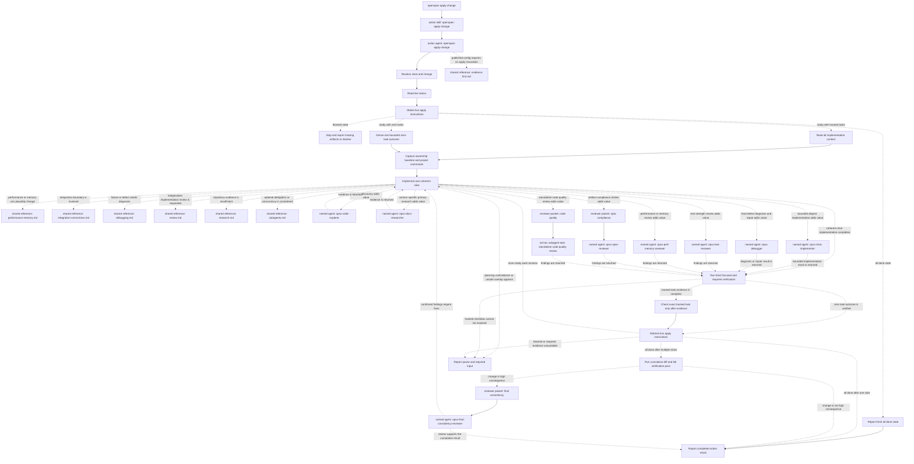

### `openspec-archive-change`

Runtime assets: [action skill](.codex/skills/openspec-archive-change/SKILL.md) and [one-hop routed action agent](.codex/agents/openspec-archive-change.toml).

**Choose it when.** Use it for one selected active change after you want readiness disclosed, delta synchronization explicitly chosen, and the entire change record moved. Say “Archive change `add-audit-log`,” “Finalize this change and sync its specs,” or “Archive without syncing after showing me the delta comparison.”

**Boundaries and result.** Readiness warnings are disclosure plus the action's existing confirmation, not a verification-action invocation or a new gate. Incomplete artifacts/tasks may proceed after confirmation; a chosen sync must succeed and match before moving. The inline semantic synchronization is a local archive stage, not an invocation of `openspec-sync-specs`. The action may write main specs, create the archive directory, and move the whole `changeRoot`; it does not implement, overwrite a target, or move after a failed sync. Success reports the exact archive path, sync status, and warnings; cancellation, collision, or sync failure reports that outcome and whether `changeRoot` remained intact.

**Runtime route and conditional support.** `openspec-archive-change` → skill → matching agent, using `gpt-5.6-terra`, effort `high`, sandbox `workspace-write`. It conditionally loads [integration correctness](.codex/skills/openspec-shared/references/integration-correctness.md), [evidence-first](.codex/skills/openspec-shared/references/evidence-first.md), [review](.codex/skills/openspec-shared/references/review.md), and [bounded delegation](.codex/skills/openspec-shared/references/subagents.md). If the runtime can perform the chosen sync only through delegation, it may dispatch one anonymous bounded `gpt-5.6-sol`/`high` sync task, wait, and verify the writes.

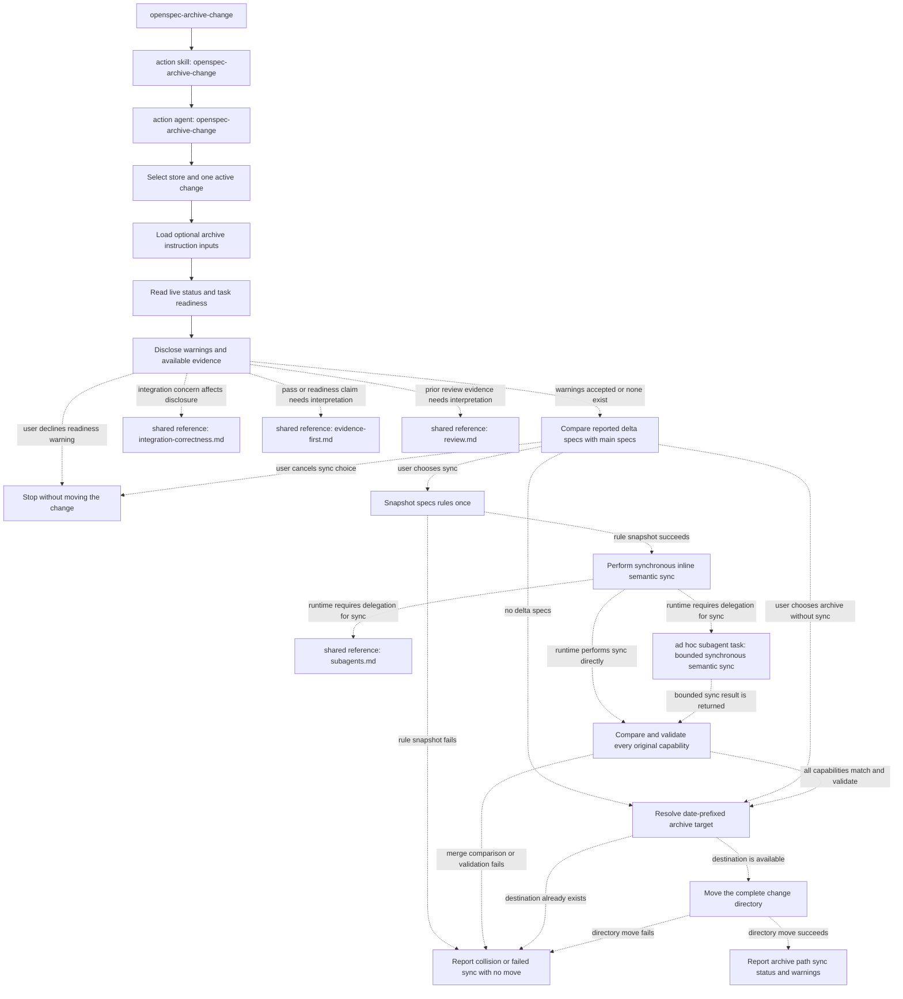

### `openspec-bulk-archive-change`

Runtime assets: [action skill](.codex/skills/openspec-bulk-archive-change/SKILL.md) and [one-hop routed action agent](.codex/agents/openspec-bulk-archive-change.toml).

**Choose it when.** Use it to select one or more active changes explicitly, consolidate readiness warnings, investigate exact-path delta conflicts, confirm once, and archive the confirmed execution set. Say “Archive these changes together,” “Archive ready changes only from this batch,” or “Resolve implementation-aware spec conflicts and bulk archive.”

**Boundaries and result.** All selected status is gathered before mutation, rule snapshots precede the first write/move, and mutations are sequential. The action investigates code/tests read-only, resolves per-delta inclusion centrally, performs synchronization inline rather than invoking another action, validates, and moves changes. It never implements code, edits change planning artifacts, commits, publishes, or invents deltas. Failures and destination collisions can yield partial results; every selected change is reported once as `Success`, `Failed`, or `Skipped`, with separate `sync skipped` entries where applicable.

**Runtime route and conditional support.** `openspec-bulk-archive-change` → skill → matching agent, using `gpt-5.6-sol`, effort `high`, sandbox `workspace-write`. Conflict investigation conditionally loads [integration correctness](.codex/skills/openspec-shared/references/integration-correctness.md), [review](.codex/skills/openspec-shared/references/review.md), and [bounded delegation](.codex/skills/openspec-shared/references/subagents.md). Anonymous read-only discovery/investigation may be delegated only when independent reads materially reduce latency; children cannot decide, write, validate, move, confirm, or redispatch.

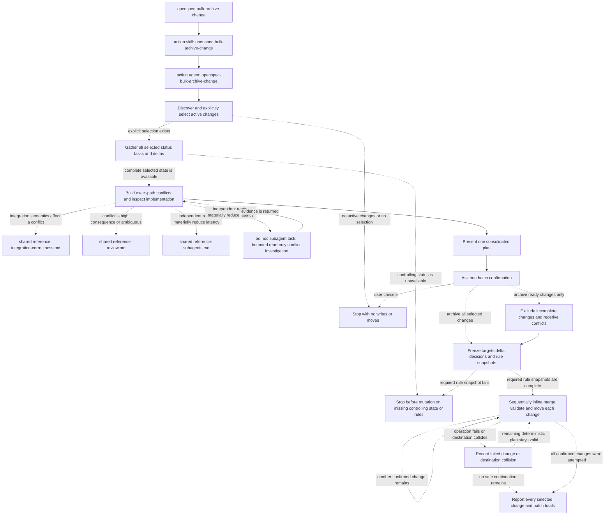

### `openspec-continue-change`

Runtime assets: [action skill](.codex/skills/openspec-continue-change/SKILL.md) and [one-hop routed action agent](.codex/agents/openspec-continue-change.toml).

**Choose it when.** Use it to create exactly the first artifact currently reported `ready` for an existing change. Say “Continue change `add-audit-log`,” “Create one more planning artifact,” or “Show what is ready next and produce it.”

**Boundaries and result.** Live status order and resolved paths control. The action reads every completed non-skipped dependency, follows the current instruction/template/context/rules, writes exactly the selected artifact output, and—only for the live proposal instruction that requires it—may make the narrow `skip_specs` metadata transition. It does not implement, edit another artifact, sync, archive, or continue into a second artifact. It reports the created path, schema, progress, skipped count, fresh ready frontier, and limitations. A skipped instruction refreshes the frontier; planning-complete, no-ready, unsafe-path, dependency-conflict, or contradictory state stops safely.

**Runtime route and conditional support.** `openspec-continue-change` → skill → matching agent, using `gpt-5.6-sol`, effort `high`, sandbox `workspace-write`. It conditionally loads [artifact quality](.codex/skills/openspec-shared/references/artifact-quality.md), [performance and memory](.codex/skills/openspec-shared/references/performance-memory.md), [integration correctness](.codex/skills/openspec-shared/references/integration-correctness.md), [research](.codex/skills/openspec-shared/references/research.md), and [bounded delegation](.codex/skills/openspec-shared/references/subagents.md). A narrow anonymous read-only discovery, version research, or materially different design comparison is allowed only when it materially benefits this artifact; artifact writing is not delegated to overlapping writers.

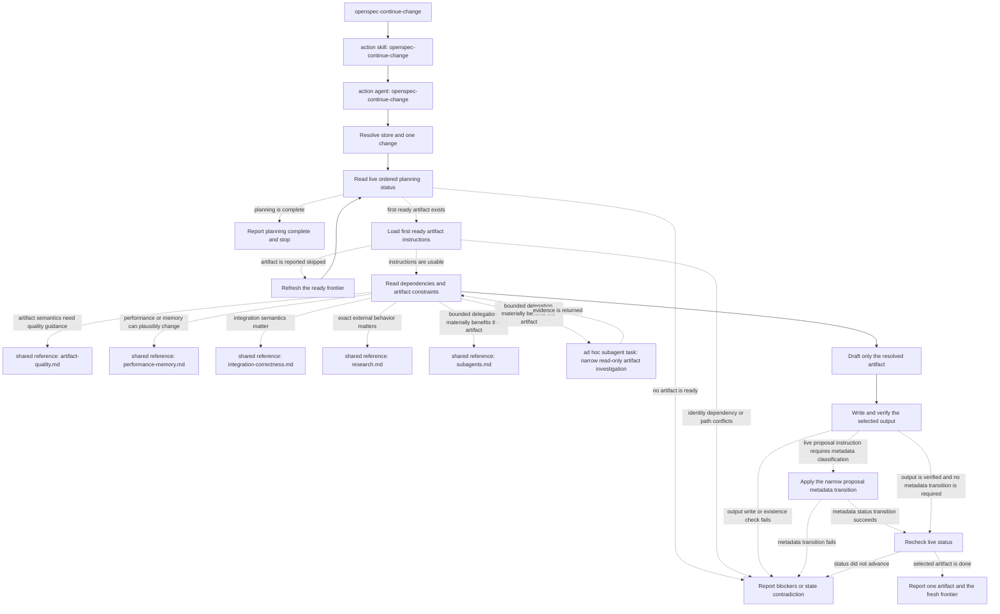

### `openspec-explore`

Runtime assets: [action skill](.codex/skills/openspec-explore/SKILL.md) and [one-hop routed action agent](.codex/agents/openspec-explore.toml).

**Choose it when.** Use it for evidence-grounded thinking before or during a change: vague requirements, domain terms, architecture, alternatives, defects, performance, integration, or version-specific research. Say “Explore this API idea,” “Reproduce and diagnose this flake without fixing it,” or “Compare viable designs before we decide.”

**Boundaries and result.** It has no mandatory artifact or fixed sequence. It may inspect repository/planning evidence and primary sources; it does not implement code or fix defects. Planning capture happens only when explicitly requested, uses live artifact ids/paths, and may scaffold a new change first; otherwise it says no artifact or code changed. It ends when the question is answered, uncertainty is bounded, or a material decision/evidence gap blocks progress, reporting observations, sources, options, recommendation if supported, assumptions, contradictions, open questions, and any captured paths.

**Runtime route and conditional support.** `openspec-explore` → skill → matching agent, using `gpt-5.6-sol`, effort `high`, sandbox `workspace-write`. It loads only applicable [artifact quality](.codex/skills/openspec-shared/references/artifact-quality.md), [performance and memory](.codex/skills/openspec-shared/references/performance-memory.md), [integration correctness](.codex/skills/openspec-shared/references/integration-correctness.md), [debugging](.codex/skills/openspec-shared/references/debugging.md), [research](.codex/skills/openspec-shared/references/research.md), and [bounded delegation](.codex/skills/openspec-shared/references/subagents.md). Anonymous bounded independent reads or comparisons are allowed only when they materially improve latency or add an evidence axis; exploration specialists remain read-only.

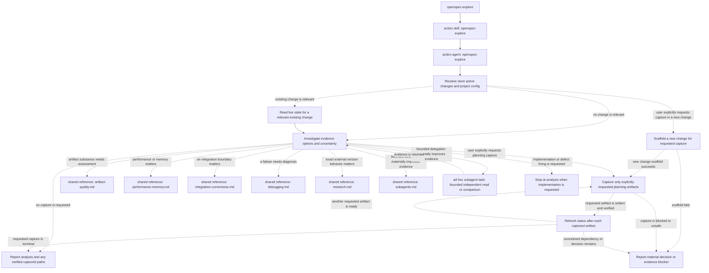

### `openspec-feedback`

Runtime assets: [action skill](.codex/skills/openspec-feedback/SKILL.md) and [one-hop routed action agent](.codex/agents/openspec-feedback.toml). The release explicitly labels this action an optional counterpart.

**Choose it when.** Use it to turn recent-conversation OpenSpec feedback into a privacy-safe report and, only after exact-draft approval, submit it. Say “Draft feedback about that OpenSpec failure,” “Anonymize this feedback,” or “Submit this exact approved version.”

**Boundaries and result.** It gathers facts only from the recent conversation and does not perform external research. Every displayed title/body is anonymized; a revision invalidates approval and requires full redisplay and fresh approval. It never changes project files, planning artifacts, code, Git, or releases. Its only authorized external side effect is one `openspec feedback "<approved title>" --body "<approved body>"` invocation after explicit approval; uncertain outcomes are not retried without a new decision. It reports exactly one of submitted with URL, not submitted with manual fallback, failed with no confirmed submission and fallback, or unknown submission state.

**Runtime route.** `openspec-feedback` → skill → matching agent, using `gpt-5.6-terra`, effort `high`, sandbox `read-only`. No shared reference, named specialist, or reviewer packet is routed by this action.

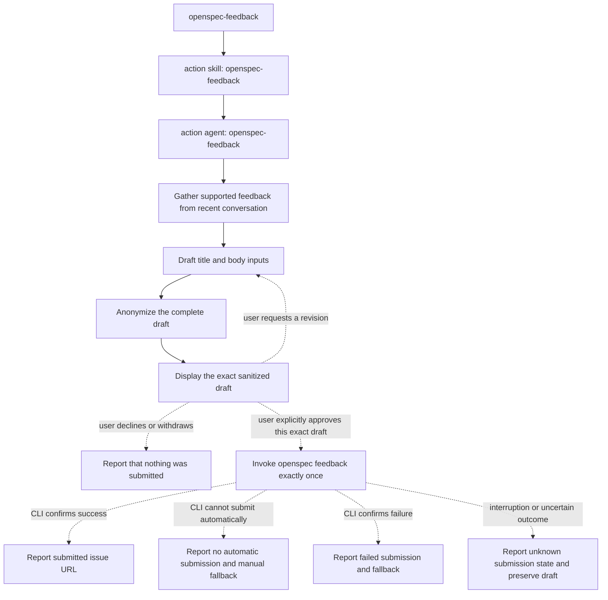

### `openspec-ff-change`

Runtime assets: [action skill](.codex/skills/openspec-ff-change/SKILL.md) and [one-hop routed action agent](.codex/agents/openspec-ff-change.toml).

**Choose it when.** Use it to create exactly one new named change and fast-forward every artifact in its live transitive apply-required closure. Say “Fast-forward a new change for audit logging,” “Generate everything needed before implementation,” or “Plan this change end to end without one-artifact pauses.”

**Boundaries and result.** It refuses an existing name rather than continuing or overwriting it. It computes the closure from live `applyRequires` and dependency edges, creates only that closure in live order, refreshes after every creation, and honors explicit conditional skips. It may make the proposal-specific `skip_specs` transition when required by live instructions. It does not implement, run apply, sync, archive, commit, publish, or create artifacts outside the closure. Success reports that all artifacts needed for implementation are ready; partial work is reported with exact state, paths, and safe next action.

**Runtime route and conditional support.** `openspec-ff-change` → skill → matching agent, using `gpt-5.6-sol`, effort `high`, sandbox `workspace-write`. It conditionally loads [artifact quality](.codex/skills/openspec-shared/references/artifact-quality.md), [performance and memory](.codex/skills/openspec-shared/references/performance-memory.md), [integration correctness](.codex/skills/openspec-shared/references/integration-correctness.md), [research](.codex/skills/openspec-shared/references/research.md), [review](.codex/skills/openspec-shared/references/review.md), and [bounded delegation](.codex/skills/openspec-shared/references/subagents.md). Anonymous narrow read-only investigation or high-consequence planning review is allowed only when it materially improves an artifact; the action remains the artifact owner.

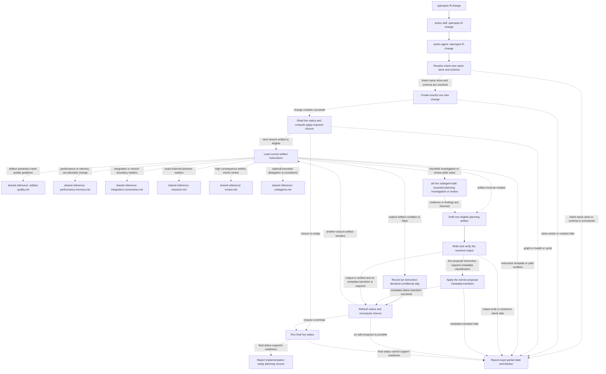

### `openspec-new-change`

Runtime assets: [action skill](.codex/skills/openspec-new-change/SKILL.md) and [one-hop routed action agent](.codex/agents/openspec-new-change.toml).

**Choose it when.** Use it to scaffold a feature, fix, refactor, tooling, documentation, or other structured change and see the first live artifact instructions without creating that artifact. Say “Start a new change for audit logging,” “Scaffold `add-audit-log` with schema `spec-driven`,” or “Show me what the first artifact will require.”

**Boundaries and result.** The action validates intent, kebab-case name, registered store, and explicit schema selection; calls `openspec new change` once; reads live status; fetches only the first `ready` artifact instructions; and stops. It may use `--description` or `--goal` only when the user explicitly requests that exact scaffold metadata/content. It never writes an artifact output, infers `skip_specs`, implements, syncs, validates, archives, or continues. The report includes authoritative scaffold/metadata paths, schema, ordered states/progress, and first-ready description/instruction/template.

**Runtime route and conditional support.** `openspec-new-change` → skill → matching agent, using `gpt-5.6-sol`, effort `high`, sandbox `workspace-write`. It normally uses no specialist. Only an unusually complex, materially useful read-only subtask may trigger [bounded delegation](.codex/skills/openspec-shared/references/subagents.md); such an anonymous task cannot scaffold, create an artifact, or choose workflow state.

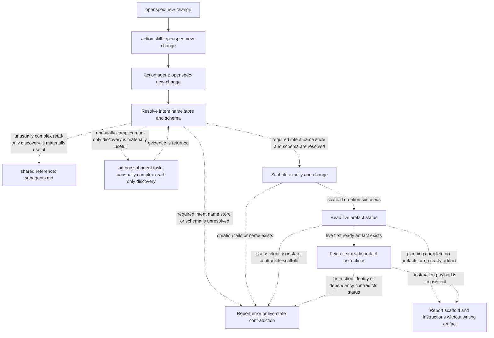

### `openspec-onboard`

Runtime assets: [action skill](.codex/skills/openspec-onboard/SKILL.md) and [one-hop routed action agent](.codex/agents/openspec-onboard.toml).

**Choose it when.** Use it for a first-time, tutorial, or guided-tour request that should complete a small real change. Say “Teach me OpenSpec with a real task,” “Walk me through a complete OpenSpec change,” or “Give me an interactive tour in this codebase.”

**Boundaries and result.** This is intentionally interactive: task choice, post-exploration acknowledgement, proposal approval when present, implementation readiness when a task artifact is present, and post-archive acknowledgement are teaching pauses. It demonstrates exploration and later mentions other actions, but does not invoke their skills or agents. It does not delegate teaching or implementation. Live schema state controls artifacts; implementation follows fresh apply state; archive runs the tutorial command `openspec archive "<name>" --yes` directly, without a separate verification phase, sync-choice interaction, or pre-archive approval. It never commits, publishes, creates branches/worktrees, or submits external data. Completion is the real planned, implemented, archived change plus recap; otherwise it reports exact resumable state.

**Runtime route and conditional support.** `openspec-onboard` → skill → matching agent, using `gpt-5.6-terra`, effort `medium`, sandbox `workspace-write`. During each implementation slice it loads [evidence-first](.codex/skills/openspec-shared/references/evidence-first.md); [debugging](.codex/skills/openspec-shared/references/debugging.md) is loaded only when diagnosis is needed. No specialist or anonymous reviewer task is authorized beyond the mandatory action route.

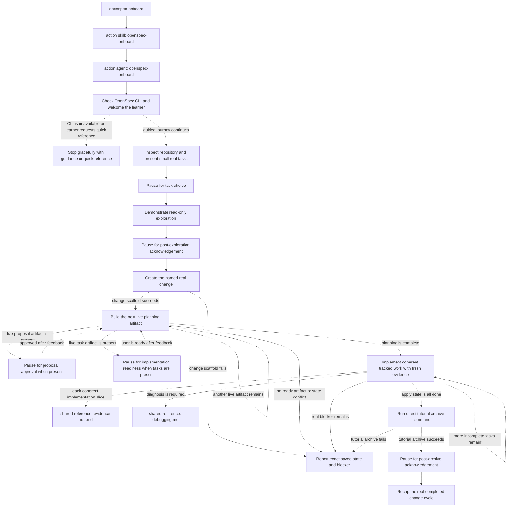

### `openspec-propose`

Runtime assets: [action skill](.codex/skills/openspec-propose/SKILL.md) and [one-hop routed action agent](.codex/agents/openspec-propose.toml).

**Choose it when.** Use it to convert one cohesive build/fix request into a new implementation-ready change in a single planning-only pass. Say “Propose a change for audit logging,” “Plan, specify, design, and task this fix,” or “Create all proposal artifacts needed before implementation.”

**Boundaries and result.** The action creates exactly one new change, computes the transitive apply-required closure from live status, and produces it in dependency order with no per-artifact approval ritual. A build/implement/fix request authorizes planning here, not application-code edits. Existing names are not adopted or overwritten. Only live-resolved outputs and the proposal-specific metadata transition may be written. It does not implement, sync, archive, commit, publish, or touch artifacts outside the closure. It reports closure membership, paths, skipped reasons, assumptions, status evidence, and says artifacts are ready for review only when live closure state supports it.

**Runtime route and conditional support.** `openspec-propose` → skill → matching agent, using `gpt-5.6-sol`, effort `xhigh`, sandbox `workspace-write`. Conditional references are [artifact quality](.codex/skills/openspec-shared/references/artifact-quality.md), [performance and memory](.codex/skills/openspec-shared/references/performance-memory.md), [integration correctness](.codex/skills/openspec-shared/references/integration-correctness.md), [research](.codex/skills/openspec-shared/references/research.md), [review](.codex/skills/openspec-shared/references/review.md), and [bounded delegation](.codex/skills/openspec-shared/references/subagents.md). Anonymous narrow read-only research/discovery or independent high-consequence artifact review is allowed only when it materially improves the artifact; it adds no gate and does not transfer ownership.

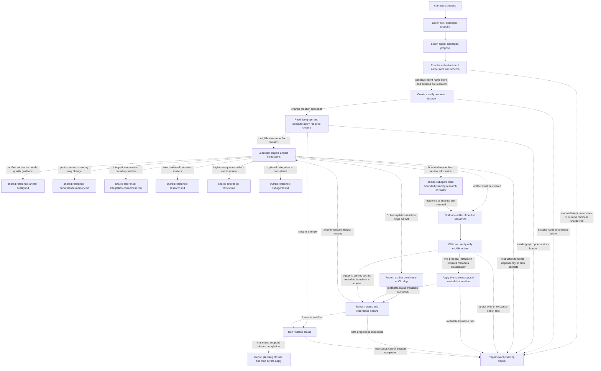

### `openspec-sync-specs`

Runtime assets: [action skill](.codex/skills/openspec-sync-specs/SKILL.md) and [one-hop routed action agent](.codex/agents/openspec-sync-specs.toml).

**Choose it when.** Use it to semantically merge all or an explicitly selected exact subset of one active change's reported delta specs into main specs while leaving the change active. Say “Sync this change's delta specs,” “Update main specs without archiving,” or “Sync only these complete delta paths.”

**Boundaries and result.** `artifactPaths.specs.existingOutputPaths` is the only eligible delta set. The action freezes the selection and one rules snapshot, models operations by exact requirement heading, preserves unmentioned behavior, and validates fresh. `ADDED`, `MODIFIED`, `REMOVED`, and `RENAMED` are semantic operations—not file copying. Guarded retirement can delete a capability spec and its now-empty directory only when every declared condition holds, including `retire_capabilities: true` and safe real paths. It never edits deltas, implementation, change planning artifacts, or archive state. Success reports changed/retired capabilities, requirement operations, validation, limitations, and that the change remains active.

**Runtime route and conditional support.** `openspec-sync-specs` → skill → matching agent, using `gpt-5.6-sol`, effort `high`, sandbox `workspace-write`. It conditionally loads [artifact quality](.codex/skills/openspec-shared/references/artifact-quality.md), [integration correctness](.codex/skills/openspec-shared/references/integration-correctness.md), [review](.codex/skills/openspec-shared/references/review.md), and [bounded delegation](.codex/skills/openspec-shared/references/subagents.md). An anonymous read-only investigation or review is allowed only for a narrow high-consequence or semantically ambiguous merge; writes remain owned and non-overlapping.

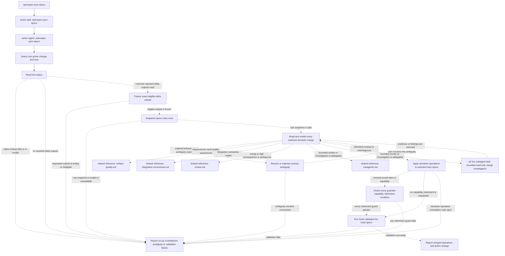

### `openspec-update-change`

Runtime assets: [action skill](.codex/skills/openspec-update-change/SKILL.md) and [one-hop routed action agent](.codex/agents/openspec-update-change.toml).

**Choose it when.** Use it to refine, correct, review, or reconcile one existing change's already-created planning artifacts. Say “Update change `add-audit-log` with this decision,” “Reconcile its proposal, specs, design, and tasks,” or “Check whether this planning edit weakens observable behavior.”

**Boundaries and result.** Only artifacts with live state `done` and their concrete `existingOutputPaths` are eligible; `resolvedOutputPath`, globs, missing outputs, and `skipped`/`ready`/`blocked` artifacts never authorize creation. The action reads all eligible artifacts, traces the revision in every direction, proposes and confirms one artifact at a time, refreshes before each write, and stops rather than overwriting drift. It may make only the confirmed proposal-specific metadata transition outside those outputs. It never edits implementation, creates an artifact, advances the frontier, syncs, verifies, archives, or starts apply. The final report lists applied, skipped/rejected, and deferred revisions, drift, status, and unresolved conflicts.

**Runtime route and conditional support.** `openspec-update-change` → skill → matching agent, using `gpt-5.6-sol`, effort `high`, sandbox `workspace-write`. It conditionally loads [artifact quality](.codex/skills/openspec-shared/references/artifact-quality.md), [performance and memory](.codex/skills/openspec-shared/references/performance-memory.md), [integration correctness](.codex/skills/openspec-shared/references/integration-correctness.md), [research](.codex/skills/openspec-shared/references/research.md), [review](.codex/skills/openspec-shared/references/review.md), and [bounded delegation](.codex/skills/openspec-shared/references/subagents.md). Anonymous read-only discovery or independent assessment may be delegated only when useful; user confirmation and artifact writes cannot be delegated.

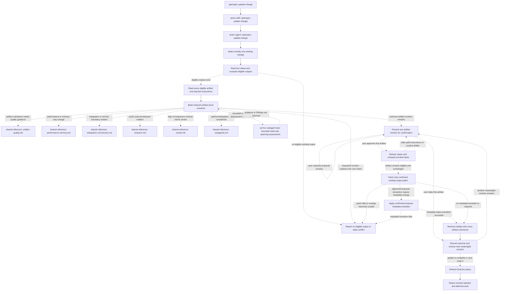

### `openspec-verify-change`

Runtime assets: [action skill](.codex/skills/openspec-verify-change/SKILL.md) and [one-hop routed action agent](.codex/agents/openspec-verify-change.toml).

**Choose it when.** Use it for a fresh, finding-oriented assessment of implementation completeness, correctness, scenario/test strength, artifact/design coherence, compatibility, integration, performance/memory, or archive readiness. Say “Verify change `add-audit-log`,” “Assess whether this is ready to archive,” or “Review its tests and implementation without fixing anything.”

**Boundaries and result.** This action is semantically read-only even though its sandbox is `workspace-write`: fresh build/test commands may create ordinary tool outputs, but it must not author or fix source, planning artifacts, task state, main specs, archive state, configuration, Git state, or a repository report. It does not install dependencies or mutate external systems without separate authorization. `blocked`, `ready`, and `all_done` apply states shape the evidence packet but do not prove pass/fail. Findings are `CRITICAL`, `WARNING`, or `SUGGESTION`; a passing readiness sentence requires sufficient fresh evidence, otherwise the final assessment explicitly says readiness is not established.

**Runtime route and conditional support.** `openspec-verify-change` → skill → matching agent, using `gpt-5.6-sol`, effort `xhigh`, sandbox `workspace-write`. Exact-need references are [artifact quality](.codex/skills/openspec-shared/references/artifact-quality.md), [evidence-first](.codex/skills/openspec-shared/references/evidence-first.md), [review](.codex/skills/openspec-shared/references/review.md), [bounded delegation](.codex/skills/openspec-shared/references/subagents.md), [integration correctness](.codex/skills/openspec-shared/references/integration-correctness.md), [performance and memory](.codex/skills/openspec-shared/references/performance-memory.md), [debugging](.codex/skills/openspec-shared/references/debugging.md), and [research](.codex/skills/openspec-shared/references/research.md).

The skill authorizes five anonymous, read-only packet tasks when the matching axis is relevant and independent context materially improves confidence: test strength (`gpt-5.6-sol`/`high`), spec correctness/completeness (`gpt-5.6-sol`/`high`), performance/memory (`gpt-5.6-sol`/`high`), focused integration/error/resource/concurrency discovery (`gpt-5.6-terra`/`high`), and final synthesis across at least three applicable axes for a high-consequence change (`gpt-5.6-sol`/`xhigh`). These are not installed specialist-agent invocations.

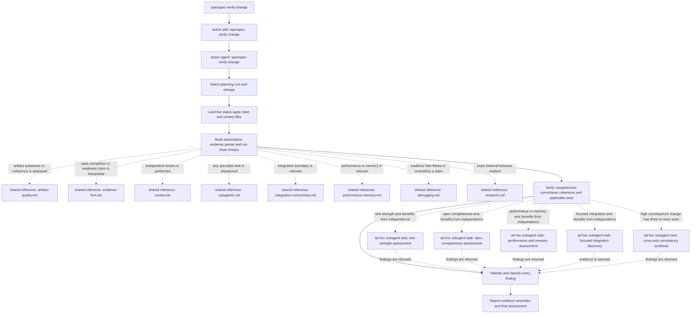

## Passive shared support

[`openspec-shared`](.codex/skills/openspec-shared/SKILL.md) is an explicitly passive, non-invocable index. It defines no user workflow, gate, route, or agent dispatch. Its references contribute conditional techniques only; they cannot widen a calling action. Passive skills are not user actions and have no action diagram.

| Owned reference | Purpose and exact load condition | Explicit action consumers | Other explicit consumers |
|---|---|---|---|
| [`artifact-quality.md`](.codex/skills/openspec-shared/references/artifact-quality.md) | Apply only the section matching live artifact semantics when drafting or assessing intent/proposal, behavioral specification, technical design, implementation tasks, or an unknown custom artifact; live instruction/template/context/rules remain authoritative. | `openspec-continue-change`, `openspec-explore`, `openspec-ff-change`, `openspec-propose`, `openspec-sync-specs`, `openspec-update-change`, `openspec-verify-change` | `opsx-spec-reviewer`; `openspec/config.yaml` rules for proposal, specs, design, and tasks |
| [`debugging.md`](.codex/skills/openspec-shared/references/debugging.md) | Diagnose a bug, failure, nondeterminism, leak, regression, or contradiction before fixing; stop blocked on the third failed hypothesis-to-fresh-verification cycle for the same failure. | `openspec-apply-change`, `openspec-explore`, `openspec-onboard`, `openspec-verify-change` | `opsx-debugger` |
| [`evidence-first.md`](.codex/skills/openspec-shared/references/evidence-first.md) | Select evidence proportionate to behavior change, bug fix, refactor, performance/memory, or integration claims; fresh applicable evidence is required for pass/complete/fixed/ready claims, and unavailable evidence is degraded rather than passing. | `openspec-apply-change`, `openspec-archive-change`, `openspec-onboard`, `openspec-verify-change` | `opsx-debugger`, `opsx-final-consistency-reviewer`, `opsx-perf-memory-reviewer`, `opsx-slice-implementer`, `opsx-spec-reviewer`, `opsx-test-reviewer`; all three apply reviewer packets; `openspec/config.yaml` apply context |
| [`integration-correctness.md`](.codex/skills/openspec-shared/references/integration-correctness.md) | Load when connector, protocol, framework, server/runtime, database, external-service, transaction, streaming, retry, cancellation, version, lifecycle, error-mapping, or conversion semantics matter. | `openspec-apply-change`, `openspec-archive-change`, `openspec-bulk-archive-change`, `openspec-continue-change`, `openspec-explore`, `openspec-ff-change`, `openspec-propose`, `openspec-sync-specs`, `openspec-update-change`, `openspec-verify-change` | The three apply reviewer packets load it only when their supplied contract/review axis applies |
| [`performance-memory.md`](.codex/skills/openspec-shared/references/performance-memory.md) | Load only when performance/memory can plausibly change or a quantitative claim is made; require comparable workload/environment and correctness evidence for before/after claims. | `openspec-apply-change`, `openspec-continue-change`, `openspec-explore`, `openspec-ff-change`, `openspec-propose`, `openspec-update-change`, `openspec-verify-change` | `opsx-perf-memory-reviewer`; the three apply reviewer packets only when that axis applies |
| [`research.md`](.codex/skills/openspec-shared/references/research.md) | Load when repository evidence is insufficient or exact dependency/protocol/framework/server/runtime versions can change the answer; use version-matched primary sources and separate fact from inference. | `openspec-apply-change`, `openspec-continue-change`, `openspec-explore`, `openspec-ff-change`, `openspec-propose`, `openspec-update-change`, `openspec-verify-change` | `opsx-docs-researcher` |
| [`review.md`](.codex/skills/openspec-shared/references/review.md) | Load for independent read-only finding-oriented assessment or when review evidence/findings must be interpreted; reviewers report, authorized implementers own fixes, and review adds no approval gate. | `openspec-apply-change`, `openspec-archive-change`, `openspec-bulk-archive-change`, `openspec-ff-change`, `openspec-propose`, `openspec-sync-specs`, `openspec-update-change`, `openspec-verify-change` | `opsx-final-consistency-reviewer`, `opsx-perf-memory-reviewer`, `opsx-spec-reviewer`, `opsx-test-reviewer`; all three apply reviewer packets |
| [`subagents.md`](.codex/skills/openspec-shared/references/subagents.md) | Load before optional specialist delegation or a parallel-read/write decision; require native bounded dispatch, explicit model/effort/fork, complete packet, no recursion, safe ownership, and evidence-based integration. | `openspec-apply-change`, `openspec-archive-change`, `openspec-bulk-archive-change`, `openspec-continue-change`, `openspec-explore`, `openspec-ff-change`, `openspec-new-change`, `openspec-propose`, `openspec-sync-specs`, `openspec-update-change`, `openspec-verify-change` | Defines the installed specialist-selection matrix and global delegation/concurrency contract |

## Specialist agents

These are installed custom-agent TOMLs without `ROUTED_ACTION`; they are specialists, not user actions. The caller column names direct action eligibility explicitly declared by agent name in an action skill. Anonymous reviewer tasks are intentionally absent.

| Specialist | Purpose | Model | Effort | Sandbox | Explicitly loaded references | Scope and boundaries | Explicitly eligible caller |
|---|---|---|---|---|---|---|---|
| [`opsx-code-explorer`](.codex/agents/opsx-code-explorer.toml) | Narrow codebase, dependency, or test discovery. | `gpt-5.6-terra` | `high` | `read-only` | None declared. | Exact supplied read scope; returns located evidence/uncertainty; cannot choose workflow/implementation decisions, write, recurse, or redispatch. | `openspec-apply-change` for focused discovery |
| [`opsx-debugger`](.codex/agents/opsx-debugger.toml) | Diagnose and, within a fixed scope, repair a hard defect, flake, leak, concurrency issue, or regression. | `gpt-5.6-sol` | `high` | `workspace-write` | [debugging](.codex/skills/openspec-shared/references/debugging.md), [evidence-first](.codex/skills/openspec-shared/references/evidence-first.md) | Cannot broaden scope, choose workflow state, recurse, or redispatch; parent approvals may be stricter. | `openspec-apply-change` for a hard defect, nondeterminism, concurrency issue, leak, or regression |
| [`opsx-docs-researcher`](.codex/agents/opsx-docs-researcher.toml) | Version-specific primary-source research for one precise claim. | `gpt-5.6-terra` | `high` | `read-only` | [research](.codex/skills/openspec-shared/references/research.md) | Exact bounded research question; returns evidence only; no artifacts, implementation decisions, workflow choice, recursion, or redispatch. | `openspec-apply-change` when exact version-specific primary research is needed |
| [`opsx-final-consistency-reviewer`](.codex/agents/opsx-final-consistency-reviewer.toml) | High-consequence consistency across three or more applicable review axes. | `gpt-5.6-sol` | `xhigh` | `read-only` | [review](.codex/skills/openspec-shared/references/review.md), [evidence-first](.codex/skills/openspec-shared/references/evidence-first.md) | Synthesizes only the complete supplied packet; returns findings; no fixes, workflow choice, recursion, or redispatch. | `openspec-apply-change` only for a high-consequence cumulative pass, using the final-review packet |
| [`opsx-perf-memory-reviewer`](.codex/agents/opsx-perf-memory-reviewer.toml) | Assess performance/memory methodology, hot paths, allocations, and measurements. | `gpt-5.6-sol` | `high` | `read-only` | [performance and memory](.codex/skills/openspec-shared/references/performance-memory.md), [review](.codex/skills/openspec-shared/references/review.md), [evidence-first](.codex/skills/openspec-shared/references/evidence-first.md) | Supplied performance/memory scope only; returns findings; no fixes, workflow choice, recursion, or redispatch. | `openspec-apply-change` when performance/memory methodology and evidence warrant independent review |
| [`opsx-slice-implementer`](.codex/agents/opsx-slice-implementer.toml) | Implement one bounded vertical slice against fixed artifacts. | `gpt-5.6-terra` | `high` | `workspace-write` | [evidence-first](.codex/skills/openspec-shared/references/evidence-first.md); other canonical references only when packet scope triggers them | Fixed file/behavior boundary; cannot choose workflow state, broaden scope, alter unrelated files, recurse, or redispatch; stops on contradiction/overlap. | `openspec-apply-change` for one dependency-independent bounded slice |
| [`opsx-spec-reviewer`](.codex/agents/opsx-spec-reviewer.toml) | Compare implementation completeness with supplied proposal, specs, design, and tasks. | `gpt-5.6-sol` | `high` | `read-only` | [artifact quality](.codex/skills/openspec-shared/references/artifact-quality.md), [review](.codex/skills/openspec-shared/references/review.md), [evidence-first](.codex/skills/openspec-shared/references/evidence-first.md) | Supplied planning/implementation packet only; returns findings; no fixes, workflow choice, recursion, or redispatch. | `openspec-apply-change` for independent task/artifact compliance, using the spec-compliance packet |
| [`opsx-test-reviewer`](.codex/agents/opsx-test-reviewer.toml) | Assess whether supplied tests can fail for the intended defect or behavior. | `gpt-5.6-sol` | `high` | `read-only` | [review](.codex/skills/openspec-shared/references/review.md), [evidence-first](.codex/skills/openspec-shared/references/evidence-first.md) | Supplied test-strength packet only; returns findings; no fixes, workflow choice, recursion, or redispatch. | `openspec-apply-change` when independent test-strength assessment adds value |

## Supporting assets

### Reviewer prompt packets

These Markdown packets are instruction assets for bounded review work; they are not actions or installed agents.

| Packet | Purpose | Caller and dispatch condition | Route | Boundary | Expected result |
|---|---|---|---|---|---|
| [`code-quality-reviewer-prompt.md`](.codex/skills/openspec-apply-change/code-quality-reviewer-prompt.md) | Independently assess code quality, project-instruction compliance, and the selected review items after contract compliance is already supplied. | `openspec-apply-change`, immediately before a bounded standalone code-quality/project-instruction review adds value for a slice. | Anonymous `spawn_agent` task; `gpt-5.6-sol`, effort `high`, `fork_turns: "none"`; fill the fenced body and send it verbatim. | Read-only, exact working directory/slice/changed paths; no contract re-review, unrelated paths, mutating commands, fixes, workflow choice, recursion, or redispatch. | Exact `STATUS: READY` or `STATUS: NEEDS_FIXES`, evidence matrix, strengths, severities, and project-instruction results; `NEEDS_FIXES` only for Critical/Important findings. |
| [`final-review-prompt.md`](.codex/skills/openspec-apply-change/final-review-prompt.md) | Review the complete high-consequence implementation as one integrated change across cross-slice consistency axes. | `openspec-apply-change`, only for a high-consequence cumulative implementation pass. | Named `opsx-final-consistency-reviewer`; `gpt-5.6-sol`, effort `xhigh`, `fork_turns: "none"`; fill the fenced body and send it verbatim. | Read-only, listed artifacts/instructions/change paths only; no mutating commands, fixes, actions, workflow choice, recursion, or redispatch. | Exact `STATUS: READY_FOR_GATE`, `STATUS: NEEDS_FIXES`, or `STATUS: ARTIFACT_BLOCKED`, with cross-slice evidence matrix, severities, instruction results, and artifact gaps. |
| [`spec-compliance-reviewer-prompt.md`](.codex/skills/openspec-apply-change/spec-compliance-reviewer-prompt.md) | Compare a bounded implementation slice with every supplied task, requirement, scenario, scope constraint, and applicable design decision. | `openspec-apply-change`, immediately before independent task/artifact compliance adds value for a slice. | Named `opsx-spec-reviewer`; `gpt-5.6-sol`, effort `high`, `fork_turns: "none"`; fill the fenced body and send it verbatim. | Read-only, listed authoritative artifacts/changed paths only; no mutating commands, fixes, workflow choice, recursion, or redispatch. | Exact `STATUS: COMPLIANT` or `STATUS: ISSUES`, per-contract evidence matrix, and categorized severities; `ISSUES` when any Critical/Important finding exists. |

### OpenSpec configuration

[`openspec/config.yaml`](openspec/config.yaml) selects schema `spec-driven`. Its project `context` mandates loading `evidence-first.md` immediately when `openspec-apply-change` is invoked, constrained to that apply action. Its artifact-keyed `rules` mandate the matching `artifact-quality.md` section before writing a proposal, specification, design, or tasks artifact. Each rule explicitly says the reference constrains only that artifact/action and adds no lifecycle gate.
